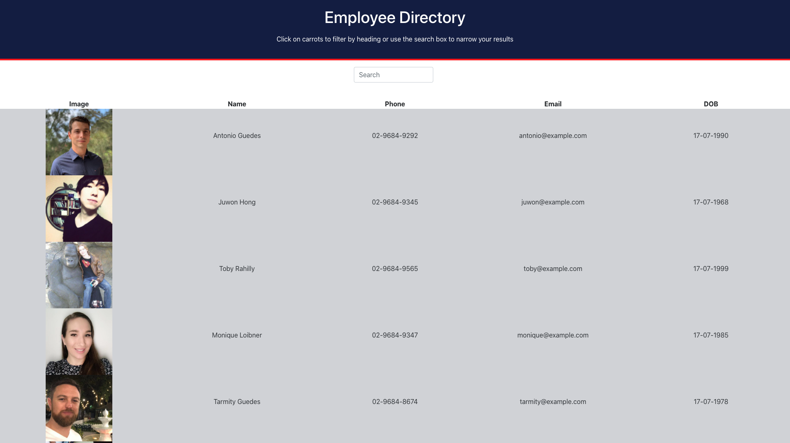

# Employee-Directory

  

  ## Description
  An Employee Directory APP that features dynamically updated HTML and CSS using JavaScript (REACT). All the data itself is rendered in a stateful component.
 
  ## Table of contents
  
  * [Installation](#installation)
  * [Usage](#usage)
  * [License](#license)
  * [Contributing](#contributing)
  * [Questions](#questions)

  ## Installation
  This app has been deployed online, please click [here](https://guedesantonio.github.io/Employee-Directory/) and start using it.

  ## Usage
  
  Open the application on the link above. Given a table of random users, when the user loads the page, a table of employees should render. 

The user should be able to:

  * Sort the table by clicking on the categories.

  * Search the employees names on the Search Bar.
  

  ## License
  This project is licensed under the MIT.

  ## Contributing
  See [Questions](#Questions) section.

  ## Questions
  If you have any questions about the repo, open an issue or contact me directly at gguedesantonio@gmail.com. 
  You can find more about my work at [Github profile](https://github.com/guedesantonio). 
